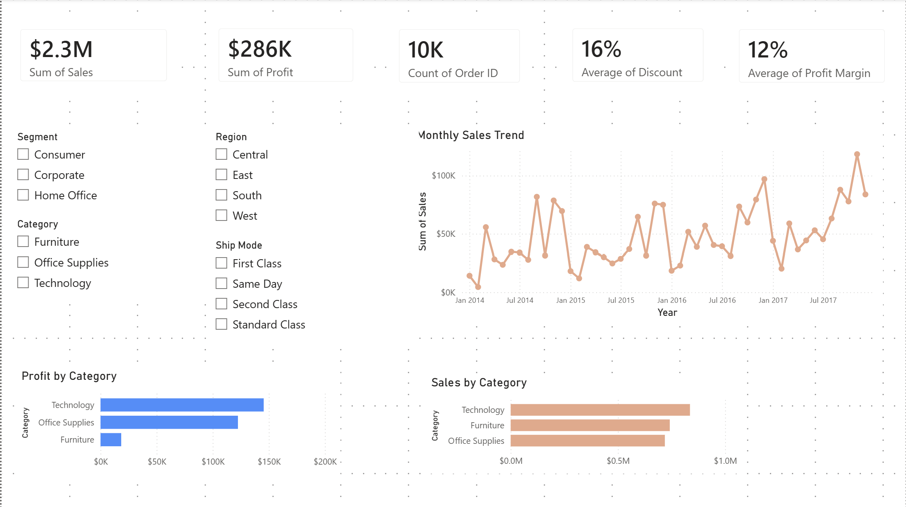
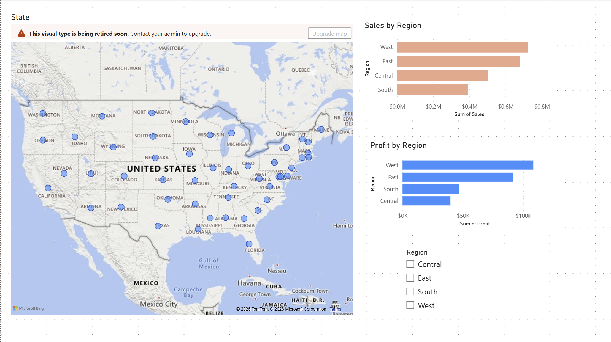
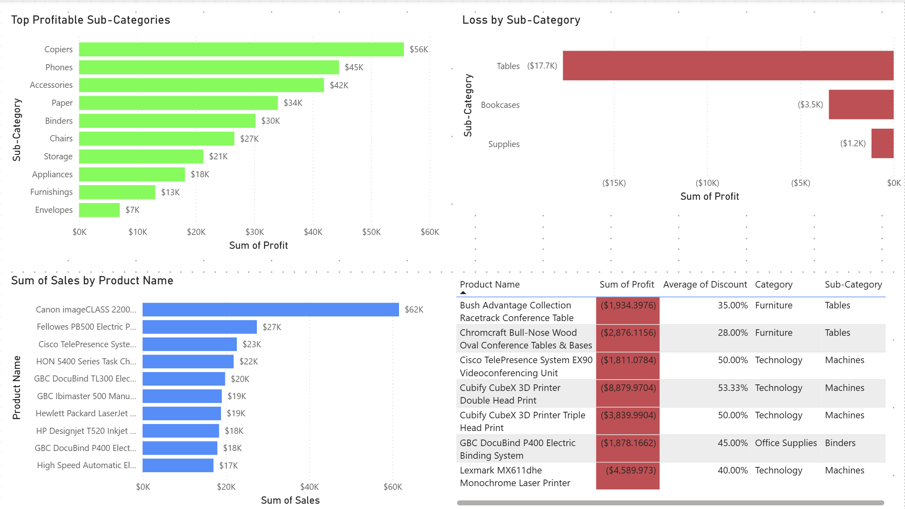
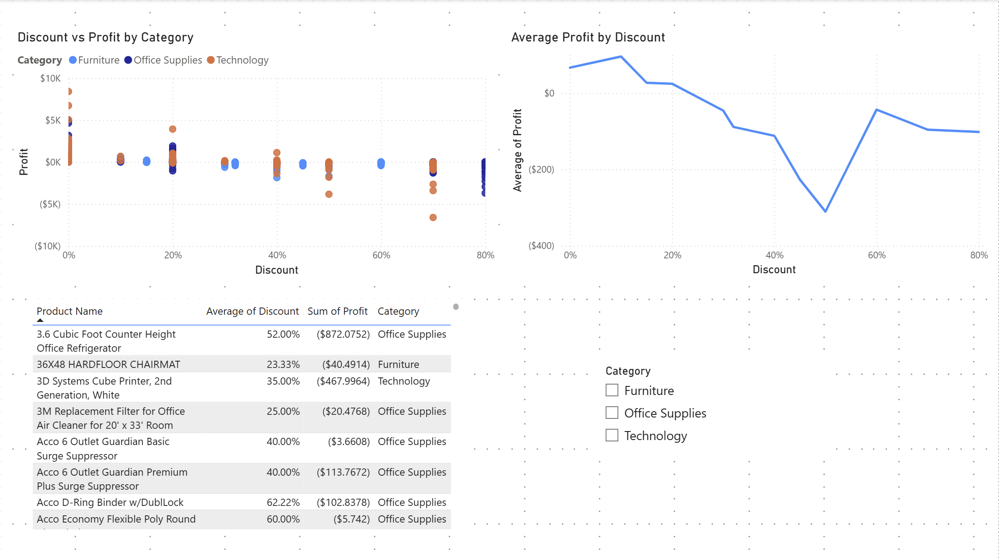

# Superstore Profit Optimization Dashboard

## Project Overview

This project analyzes Superstore sales data using Python and Power BI to identify:

- profitable product categories
- loss-making products
- regional performance
- discount impact on profitability
- sales trends over time

The objective was to derive business insights and create an executive-level dashboard for decision-making.

---

# Tools & Technologies

- Python
- Pandas
- NumPy
- Matplotlib
- Power BI
- Git & GitHub

---

# Dashboard Pages

## 1. Executive Summary

Provides high-level KPIs including:
- Total Sales
- Total Profit
- Total Orders
- Average Discount
- Profit Margin

Includes:
- Monthly sales trend
- Sales by category
- Profit by category
- Interactive slicers

---

## 2. Regional Analysis

Analyzes:
- Sales by region
- Profit by region
- State-wise profitability

Helps identify high-performing and low-performing regions.

---

## 3. Product & Category Analysis

Highlights:
- Top profitable sub-categories
- Loss-making sub-categories
- Top-selling products
- Products generating losses

Used to identify:
- strong-performing product segments
- categories negatively affecting margins

---

## 4. Discount & Profitability Analysis

Analyzes relationship between:
- discounting
- profitability

Key insight:

> Higher discounts generally reduce profitability and increase losses.

Includes:
- Discount vs Profit scatter plot
- Average Profit by Discount trend
- High-discount loss-making products table

---

# Key Business Insights

- Technology category generates the highest profit.
- Tables sub-category generates the highest losses.
- West region performs best in both sales and profit.
- Higher discounts are strongly associated with lower profitability.
- Q4 months show stronger sales performance.

---

# Project Structure

```plaintext
SUPERSTORE-PROFIT-OPTIMIZATION/
│
├── backend/
│   ├── analysis/
│   │   ├── data_cleaning.py
│   │   ├── discount_analysis.py
│   │   ├── monthly_analysis.py
│   │   ├── profit_analysis.py
│   │   ├── sales_analysis.py
│   │   └── visualizations.py
│   │
│   ├── data/
│   │   ├── superstore_cleaned.csv
│   │   └── superstore_raw.csv
│   │
│   ├── outputs/
│   │   ├── charts/
│   │   │   ├── discount_vs_profit.png
│   │   │   ├── profit_by_category.png
│   │   │   └── sales_by_category.png
│   │   │
│   │   ├── reports/
│   │   │
│   │   └── summaries/
│   │       ├── category_discount_summary.csv
│   │       ├── category_profit_summary.csv
│   │       ├── category_sales_summary.csv
│   │       └── monthly_sales_summary.csv
│   │
│   ├── app.py
│   └── requirements.txt
│
├── docs/
│   ├── business_problem.md
│   └── dashboard_plan.md
│
├── frontend/
│
├── powerbi/
│   └── superstore_dashboard.pbix
│
├── screenshots/
│   ├── executive_summary_pbi.png
│   ├── regional_analysis_pbi.png
│   ├── product_and_category_analysis_pbi.png
│   └── discount_and_profitability_analysis_pbi.png
│
├── .gitignore
├── LICENSE
└── README.md
```

---

# Dashboard Screenshots

## Executive Summary



---

## Regional Analysis



---

## Product & Category Analysis



---

## Discount & Profitability Analysis



---

# How to Run

## Clone Repository

```bash
git clone https://github.com/vrm2310/superstore-profit-optimization.git
```

---

## Install Dependencies

```bash
pip install -r backend/requirements.txt
```

---

## Run Data Cleaning Script

```bash
python backend/analysis/data_cleaning.py
```

---

# Future Improvements

- Add SQL integration
- Deploy dashboard online
- Add forecasting models
- Create Streamlit/Flask frontend
- Add customer segmentation analysis
- Implement advanced DAX measures

---

# Author

Vyom Mangtani